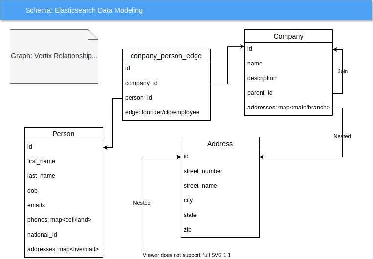

# Entity Resolution

**Entity resolution** (ER) is the task of disambiguating records that correspond to real world **entities** across and
within datasets.

The problems associated with entity resolution are equally big as the volume and velocity of data grow, inference across
networks and semantic relationships between entities becomes increasingly difficult. This project attempts to provide a
solution using *Elasticsearch* and *Graph* Database.

## Overview

<p align="center">
  
</p>

<!--  -->
<!--
 -->

Links: [RedisGraph](docs/redis.md), [Data Modeling](docs/modeling.md)

## Getting Started

### Clone

```shell
gh repo clone xmlking/entity-resolution
```

### Install dependencies

```shell
export GOPRIVATE=github.com/entity-resolution/*,go.buf.build
go work sync
go mod tidy
```

### Install git hooks

```shell
# cog install-hook all
cog install-hook commit-msg
# you can verify if the hooks are installed by running
cat .git/hooks/commit-msg
```

## Maintenance

Update generated proto code from **BSR**, after you publish **proto** to [BSR](https://buf.build/entiy-resolution)

```shell
export GOPRIVATE=github.com/entity-resolution/*,go.buf.build
go get go.buf.build/grpc/go/entity-resolution/entityapis
go work sync
```

update outdated Go dependencies interactively

```shell
export GOPRIVATE=github.com/entity-resolution/*,go.buf.build 

go-mod-upgrade
# then commit the changes. 
```

### Update deps

```shell
go work sync
task mod:outdated
task mod:sync
task mod:verify
```

### Lint Code

before commit, line your code with following command in the order:

```shell
go fmt ./...
#golangci-lint --version
golangci-lint run -c .github/linters/.golangci.yml
```

## Development

### Launch Redis

```shell
docker compose up
# docker compose up redis
# open Grafana UI and enable redis plugin
open http://localhost:3000/plugins/redis-app/
open http://localhost:3000/dashboards

# to ssh to grafana
docker-compose exec grafana /bin/bash
cd /etc/grafana/provisioning

# stop
docker compose down
# this will stop redis and remove all volumes
docker compose down -v 
```

### Run

```shell
# first generate go code.
go generate ./... 
# run engine
go run ./service/entity/... 
#go run ./cmd/er/...   
```

To see all _config_ **environment variable** options, run:

```shell
CONFY_LOG_LEVEL=debug \
CONFY_DEBUG_MODE=true \
CONFY_VERBOSE_MODE=true \
go run ./service/entity/... 
```

### Test

```shell
# first generate go code. <-- IMPORTANT
go generate ./... 

go test -v ./service/entity/... 
go test -v ./cmd/er/...   
```

### Build

```shell
# first generate go code.
go generate ./... 
go build -o build ./service/entity/... 
go build -o build ./cmd/er/...
```

### Release

Following command bump **VERSION** number and push `changes` and `tag` to remote<br/>
Then, [GitHub Action](.github/workflows/release.yml) trigger `GoReleaser` process.

> NOTE: make sure you commit all changes before running this command.

```shell
### 
```shell
# dry-run: calculate the next version based on the commit types since the latest tag
cog bump --auto --dry-run 
# calculate the next version based on the commit types since the latest tag
cog bump --auto
```

* check [cog](https://docs.cocogitto.io/guide/#automatic-versioning) docs
* check [GoReleaser](./docs/goreleaser.md) docs

### Verify

```shell
Test multi-platform docker images
```shell
docker run -it --rm --init --platform linux/amd64 ghcr.io/xmlking/entity-resolution/entity:latest
docker run -it --rm --init --platform linux/arm64 ghcr.io/xmlking/entity-resolution/entity:latest
```

### Local Docker Build

multi-platform, multi-stage, multi-module local build

```shell
#VERSION=$(git describe --tags || echo "HEAD")
VERSION=v0.1.262
BUILD_DATE=$(date +%FT%T%Z)
DOCKER_IMAGE=ghcr.io/xmlking/entity-resolution/entity

# build 
docker buildx create --use

docker buildx build --platform linux/arm64,linux/amd64 \
-t $DOCKER_IMAGE:$VERSION \
-t $DOCKER_IMAGE:latest \
--build-arg BUILD_DATE=$BUILD_DATE --build-arg VERSION=$VERSION \
--secret id=BUF_TOKEN,src=buf_token.txt \
-f Dockerfile.local --push .

# inspect
docker buildx imagetools inspect $DOCKER_IMAGE:$VERSION
docker buildx imagetools inspect --raw $DOCKER_IMAGE:$VERSION

# run
docker run -it --rm --platform linux/arm64 $DOCKER_IMAGE:$VERSION
docker run -it --rm --platform linux/amd64 $DOCKER_IMAGE:$VERSION
# Notice `platform` in the build_info logs
# build_info={"branch":"main","build_time":"","commit":"","compiler":"gc","go_version":"go1.19","platform":"linux/arm64","state":"dirty","tag":""}
```

## TODO

- [x] Start/Stop ES with docker-compose
- [ ] Generate test data
- [ ] Batch load test data with [benthos](https://www.benthos.dev/)
- [ ] GoLang
    - [ ] [redisearch-go](https://github.com/RediSearch/redisearch-go) 
    - [ ] [Connect-Go](https://connect.build/docs/go/getting-started/) 
    - [ ] [Connect-Web](https://connect.build/docs/web/getting-started/)

## Reference

- [zentity](https://zentity.io/)
- [real-time-entity-resolution](https://www.slideshare.net/o19s/real-time-entity-resolution-with-elasticsearch-haystack-2018)
- [zentity-docs](https://zentity.io/docs/basic-usage/)
- [GraphAware Graph-Aided Search](https://github.com/graphaware/graph-aided-search)
- [Graph-Powered Search: Neo4j & Elasticsearch](https://graphaware.com/assets/graphpoweredsearch-neo4j-elasticsearch.pdf)
